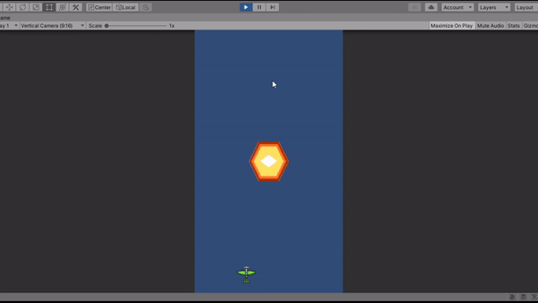

# Bullet-Hell-Feature-Practice
This is just a practice project to see if I can create something similar to a bullet hell. The implementations in this project is not something I can call satisfying.

The gif below shows what the bullet hell feature looks like. How it works? Basically has a spawner script that creates points around transform.position, take a bullet object from the pool and set the bullets direction. The bullet will move forward according to its direction/rotation.

